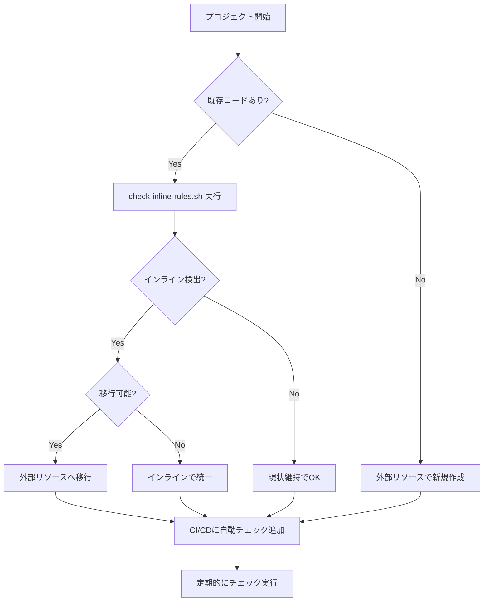

# インラインルールの判断方法ガイド

## 概要

Terraformでセキュリティグループを管理する際、インラインルールと外部リソースの混在を避ける必要があります。このガイドでは、インラインルールを検出する複数の方法を説明します。

---

## 方法1: Terraformコードで判断（推奨）

### 1-1. 手動確認

セキュリティグループリソース定義を確認します。

#### ❌ インラインルール（検出対象）

```hcl
resource "aws_security_group" "example" {
  vpc_id = aws_vpc.main.id

  # これがインラインルール
  ingress {
    from_port   = 22
    to_port     = 22
    protocol    = "tcp"
    cidr_blocks = ["0.0.0.0/0"]
  }

  # これもインラインルール
  egress {
    from_port   = 0
    to_port     = 0
    protocol    = "-1"
    cidr_blocks = ["0.0.0.0/0"]
  }
}
```

**判断基準**: `ingress { ... }` または `egress { ... }` ブロックがある

#### ✅ 外部管理（推奨）

```hcl
resource "aws_security_group" "example" {
  vpc_id = aws_vpc.main.id
  # ingress/egressブロックなし
}

# 別リソースで管理
resource "aws_security_group_rule" "ssh" {
  type              = "ingress"
  from_port         = 22
  to_port           = 22
  protocol          = "tcp"
  cidr_blocks       = ["0.0.0.0/0"]
  security_group_id = aws_security_group.example.id
}
```

**判断基準**: `ingress { ... }` や `egress { ... }` ブロックが存在しない

### 1-2. 自動チェックスクリプト

提供されている `check-inline-rules.sh` を使用します。

```bash
# 実行権限を付与
chmod +x check-inline-rules.sh

# チェック実行
./check-inline-rules.sh
```

#### 出力例（インラインルール検出時）

```
======================================
Terraform インラインルールチェッカー
======================================

📄 チェック中: main.tf

  🔴 インラインルール検出: aws_security_group.pattern1_sg
      - ingress ブロック: 1 個
      - egress ブロック: 0 個
      - ファイル: main.tf:13

======================================

⚠️  警告: インラインルールが検出されました

外部リソース（aws_security_group_rule など）と混在させないでください。
```

#### 出力例（インラインルールなし）

```
✅ 問題なし: インラインルールは検出されませんでした

すべてのルールが外部リソースで管理されています（推奨）
```

### 1-3. grep コマンドでクイック確認

```bash
# インラインルールの検索
grep -r "^\s*ingress\s*{" *.tf
grep -r "^\s*egress\s*{" *.tf

# 何も出力されなければインラインルールなし
```

---

## 方法2: Terraform Stateで判断

### 2-1. State内容の確認

```bash
# セキュリティグループの状態を表示
terraform state show aws_security_group.<name>
```

#### インラインルールがある場合

```hcl
# aws_security_group.pattern1_sg:
resource "aws_security_group" "pattern1_sg" {
    id          = "sg-xxxxx"
    vpc_id      = "vpc-yyyyy"

    # ingressがState内に含まれている
    ingress     = [
        {
            cidr_blocks      = [
                "0.0.0.0/0",
            ]
            description      = "SSH (inline rule)"
            from_port        = 22
            to_port          = 22
            protocol         = "tcp"
            # ...
        },
    ]
}
```

**判断基準**: `ingress = [ ... ]` または `egress = [ ... ]` が含まれている

#### インラインルールがない場合

```hcl
# aws_security_group.test_sg:
resource "aws_security_group" "test_sg" {
    id          = "sg-xxxxx"
    vpc_id      = "vpc-yyyyy"

    # ingressは空配列または存在しない
    ingress     = []
    egress      = []
}
```

**判断基準**: `ingress` と `egress` が空配列 `[]`

### 2-2. すべてのリソースをリスト

```bash
# 管理されているリソース一覧
terraform state list
```

#### 出力例（混在パターン - 危険）

```
aws_security_group.pattern1_sg
aws_security_group_rule.pattern1_http          ← 外部リソース
aws_vpc.conflict_test_vpc
```

この場合、`pattern1_sg`を確認して`ingress`ブロックがあれば**競合発生**。

#### 出力例（安全パターン）

```
aws_security_group.example
aws_security_group_rule.http                   ← 外部リソースのみ
aws_security_group_rule.https                  ← 外部リソースのみ
aws_vpc.main
```

セキュリティグループ本体にインラインルールがなければ**安全**。

---

## 方法3: terraform plan での検出

### 競合がある場合の兆候

インラインルールと外部リソースが混在している場合、以下のような**意図しない変更**が`terraform plan`で表示されます：

```
Terraform will perform the following actions:

  # aws_security_group.pattern1_sg will be updated in-place
  ~ resource "aws_security_group" "pattern1_sg" {
      ~ ingress = [
          - {  # ← 外部リソースで追加したルールを削除しようとする
              cidr_blocks = ["0.0.0.0/0"]
              from_port   = 80
              protocol    = "tcp"
              to_port     = 80
            },
            {  # ← インラインルールは維持
              cidr_blocks = ["0.0.0.0/0"]
              from_port   = 22
              protocol    = "tcp"
              to_port     = 22
            },
        ]
    }

Plan: 0 to add, 1 to change, 0 to destroy.
```

**判断基準**: 何も変更していないのに`terraform plan`で差分が出る場合、競合の可能性が高い

---

## 方法4: AWS側での確認（参考情報）

### 重要な注意点

**AWS API/コンソールからはインラインルールと外部リソースを区別できません。**

AWS側では、すべてのルールが同じように表示されます：

```bash
aws ec2 describe-security-groups --group-ids sg-xxxxx
```

出力例:
```json
{
  "SecurityGroups": [
    {
      "IpPermissions": [
        {
          "FromPort": 22,
          "ToPort": 22,
          "IpProtocol": "tcp"
        },
        {
          "FromPort": 80,
          "ToPort": 80,
          "IpProtocol": "tcp"
        }
      ]
    }
  ]
}
```

どちらのルールも同じように表示され、管理方法（インライン/外部）は識別不可。

**判断には必ずTerraformコードまたはStateを使用してください。**

---

## 方法5: CI/CDパイプラインでの自動チェック

### GitHub Actions の例

```yaml
name: Terraform Validation

on: [push, pull_request]

jobs:
  check-inline-rules:
    runs-on: ubuntu-latest
    steps:
      - uses: actions/checkout@v3

      - name: Check for inline security group rules
        run: |
          chmod +x check-inline-rules.sh
          ./check-inline-rules.sh

      - name: Fail if inline rules detected
        if: failure()
        run: |
          echo "::error::インラインルールが検出されました。外部リソースと混在させないでください。"
          exit 1
```

---

## チェックリスト

プロジェクトでインラインルールの有無を確認する際のチェックリスト：

- [ ] すべての`.tf`ファイルで`aws_security_group`リソースを検索
- [ ] 各セキュリティグループ内に`ingress { ... }`ブロックがないか確認
- [ ] 各セキュリティグループ内に`egress { ... }`ブロックがないか確認
- [ ] `terraform state list`で外部リソース（`aws_security_group_rule`など）の存在を確認
- [ ] インラインと外部が混在していないか確認
- [ ] `./check-inline-rules.sh`を実行して自動チェック

---

## 推奨フロー



---

## まとめ

### 最も確実な方法

1. **`check-inline-rules.sh`を実行**（自動化）
2. **Terraformコードを目視確認**（`ingress/egress`ブロックの有無）
3. **`terraform state show`で確認**（State内の`ingress/egress`属性）

### AWS側では判断不可

- AWS APIやコンソールからは区別できない
- 必ずTerraform側で確認する

### CI/CDで自動化

- プルリクエスト時に自動チェック
- インラインルールの混入を防止

---

## 関連ドキュメント

- [競合検証レポート](CONFLICT_VERIFICATION_REPORT.md)
- [ベストプラクティス](README.md#ベストプラクティス)
- [Terraform公式: aws_security_group](https://registry.terraform.io/providers/hashicorp/aws/latest/docs/resources/security_group)
